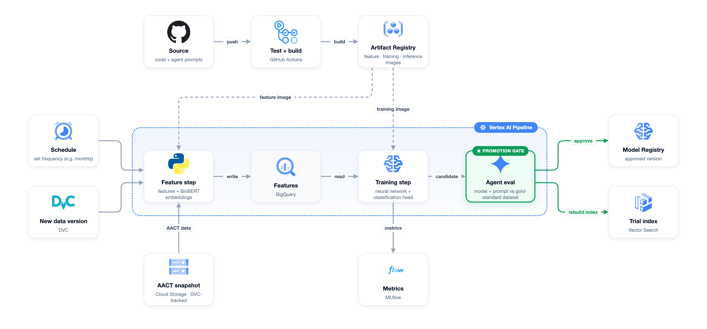
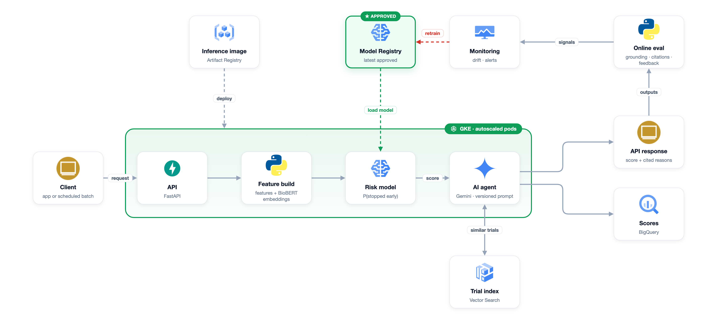

# Predicting Early Termination of Clinical Trials

MLOps course project (Northeastern University). The system predicts the probability that a registered clinical trial will be stopped early (terminated, withdrawn, or suspended) from its design, and an agentic AI system explains why a flagged trial is at risk by citing similar past trials that were stopped.

## Approach

- **Data:** ClinicalTrials.gov, accessed through the AACT database (monthly PostgreSQL snapshot). One row is one trial, identified by its NCT ID.
- **Baseline:** a classical ML model (gradient-boosted trees or logistic regression) on the structured design features.
- **Main model:** BioBERT text embeddings (not fine-tuned) combined with the structured features in a neural network with a classification head.
- **Agentic system:** looks up similar past stopped trials in the structured data and a text index, reads their recorded stop reasons, and writes a cited explanation.
- **Platform:** Google Cloud (Vertex AI Pipelines, BigQuery, Cloud Storage, Artifact Registry, GKE, Vertex AI Vector Search), with GitHub Actions, DVC, and MLflow.

## Repository structure

```
clinical-trial-termination/
|- data/        raw and processed data (DVC-tracked, not committed)
|- src/         ingestion, features, model, and agent code
|- pipelines/   pipeline definitions (ingest, train, evaluate, deploy)
|- tests/       unit and integration tests
|- docs/        project scoping document and diagrams
|- README.md
```

## Architecture

Training pipeline:



Inference pipeline:



## Setup

Setup and usage instructions will be added as the data pipeline is built.

## Team

- Atharva Nilesh Mahadik
- Danush Gopinath
- Nithish Bhat
- Pavanchytanya Dharmapuri
- Sathyasai Rajan
- Sivapriya Sugumaran

## Data rights

ClinicalTrials.gov and AACT (CTTI) data are public. The data is trial-level and contains no patient-level personal data.
